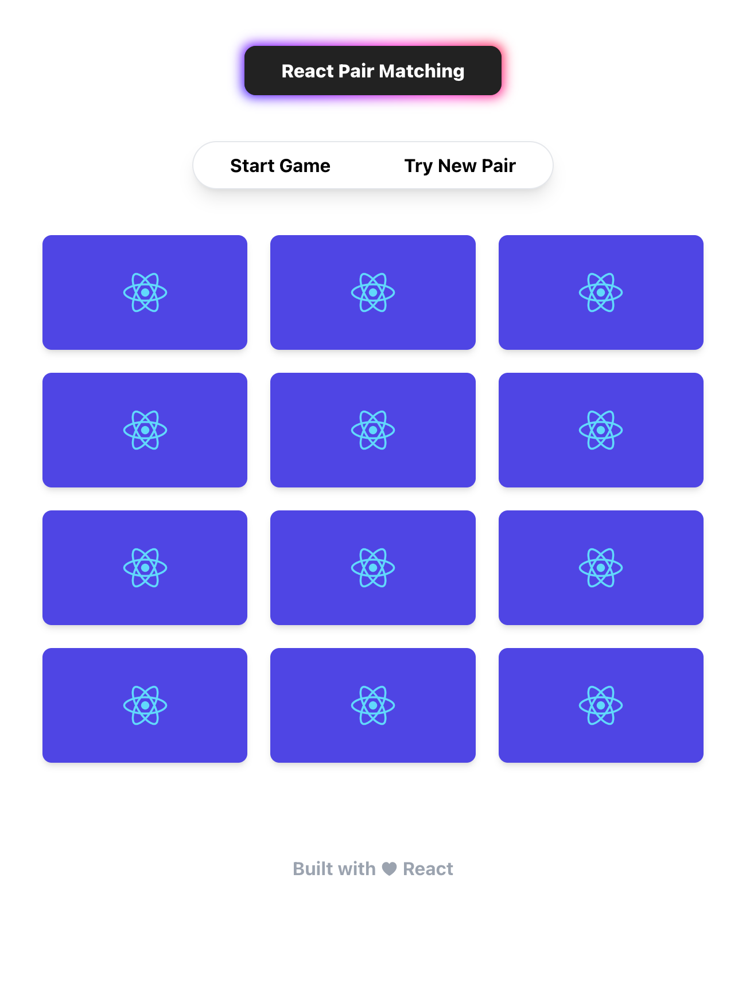

# Pair Matching

## Project Screen Shots

### Dependencies

@reduxjs/toolkit: ^1.9.0,
react-redux: ^8.0.5,
redux: ^4.2.0,
styled-components: ^5.3.6,
tailwindcss: ^3.2.3

### Available Scripts

In the project directory, you can run:

### `npm install`

To install all of the needed dependencies, then:

### `npm start`

Runs the app in the development mode.\
Open [http://localhost:3000](http://localhost:3000) to view it in your browser.

You may also see any logs in the console when performing any form submission event.

