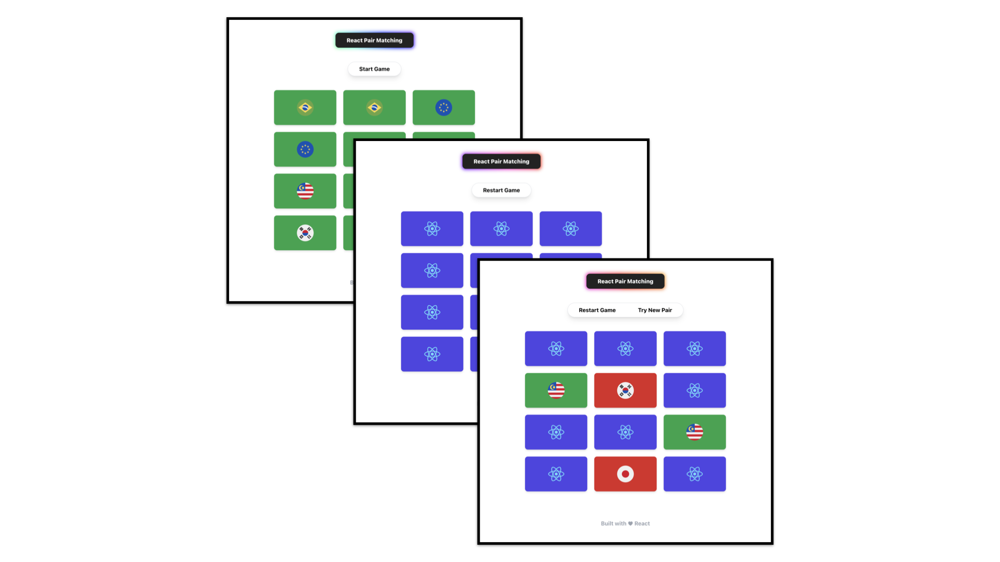

# Pair Matching

Yuhu, another project is done. I feel like my mind does not as sharp as it used to and I think it's gonna take a while to really get back in the zone again. Well, I've been coding for about two weeks straight now, let's see what I could do in the next two weeks.

A little about this project: a pair-matching game, where you need to match every pairs of identical images and it surely involves a little bit of memory power. Doing this project, I did read code from codeacademy and tried my best to rewrite it with my own understanding. So, there is a certain degree of similarity there. As [previous project](https://github.com/arulhasbi/flash-card), I'd like to encourage my fellow react learner to fork and contribute to this project. Here are some of my suggesstions for new features.

1. Add different difficulties.
2. Add guessing score. etc.

Yup, I think that's all. See you guys in the next project. Peace!

Please proceed to [the site](https://phenomenal-souffle-72ebf5.netlify.app/) if you guys want to try out the game.

## Project Screen Shots

### Dependencies

- @reduxjs/toolkit: `^1.9.0`
- react-redux: `^8.0.5`
- redux: `^4.2.0`
- styled-components: `^5.3.6`
- tailwindcss: `^3.2.3`

### Available Scripts

In the project directory, you can run:

### `npm install`

To install all of the needed dependencies, then:

### `npm start`

Runs the app in the development mode.\
Open [http://localhost:3000](http://localhost:3000) to view it in your browser.

You may also see any logs in the console when performing any form submission event.

